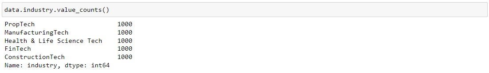

# ML_NLP_Case_Study

In this case study, a dataset of 7,500 companies that includes the company name and a text description of its activity is investigated. 


A training set of 5,000 companies is provided with their respective categorization labels. The dataset is provided for 5 classes with equal distribution.



## Objective

A testing set of 2,500 companies including their text description is provided without their labels.
The objective is to to predict the industry lables of the 2,500 companies in the test set using NLP machine learning techniques.

## Key Requirements
- Numpy
- Pandas
- Natural Language Toolkit (nltk)
- Matplotlib
- Scikit-learn

## The dataset
The repository includes a dataset folder containing the training and evaluation datasets as csv files

## Installation
You can clone this repository using git by using this command
```$ gh repo clone Moataz-Ab/ML_NLP_Case_Study```

## Approach
- The text in the description column is preprocessed prior to NLP modeling
- A Naive Bayes model is created as a base line
- After evaluating a few potential models, a LogisticRegression model is selected
- The model is fine-tuned using grid search optimization

## Results
- F1 Macro is used as a scoring metric to consider both precision and recall while giving equal importance to all classes
- The optimized model presents **86.8%** F1 Macro score

## Installation
You can clone this repository using git by using this command
```$ gh repo clone Moataz-Ab/ML_NLP_Case_Study```

## Contributions
Pull requests and bug reports are welcome :)
