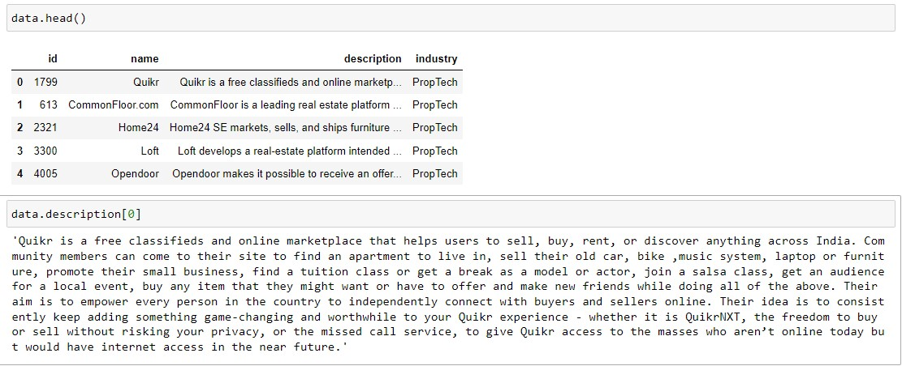

# ML_NLP_Case_Study

In this case study, a dataset of 7,500 companies that includes the company name and a text description of its activity is investigated. 
A training set of 5,000 companies is provided with their respective categorization labels. A testing set of 2,500 companies is provided without their labels. 
The objective is to to predict the categorization labels of the 2,500 companies in the test set using machine learning techniques.

